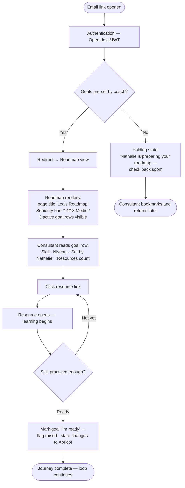
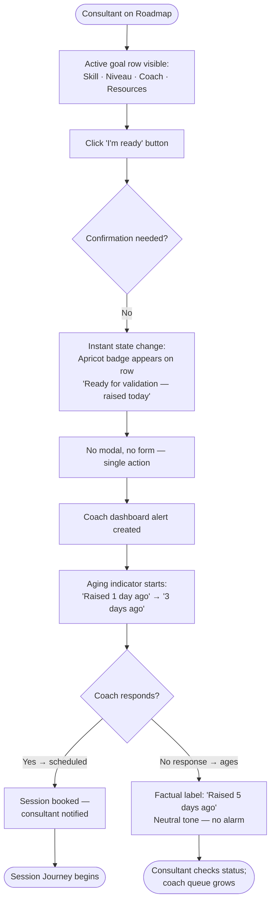
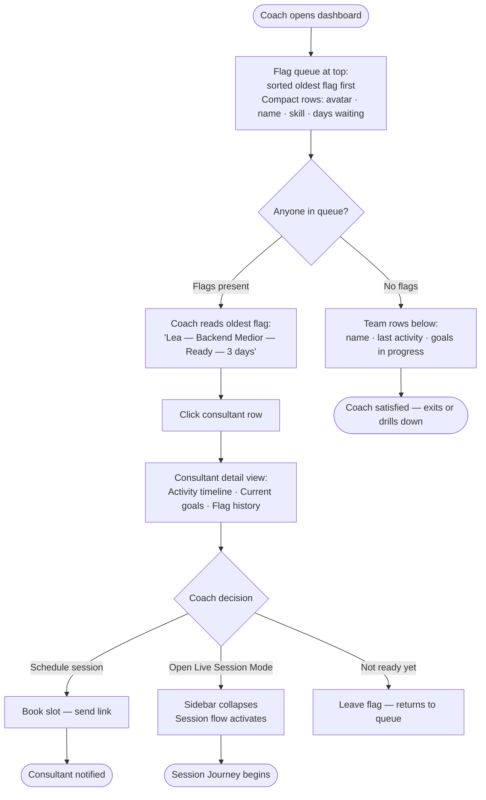
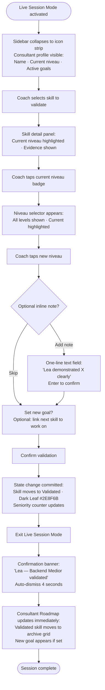

# UX Design Specification - Bootcamp-AI (SkillForge)

**Author:** Olivier
**Date:** 2026-02-27

---

<!-- UX design content will be appended sequentially through collaborative workflow steps -->

## Executive Summary

### Project Vision

SkillForge replaces the invisible coaching relationship with a shared, always-current record of consultant growth. The central UX proposition: a consultant who logs in for the first time should never see an empty screen — their coach has already thought about them, and the platform makes that care visible and actionable.

### Target Users

| User | Role | Context | Primary UX Goal |
|---|---|---|---|
| Consultant (e.g. Lea) | `learner` | Async, self-directed, checks in between missions | "Where am I and what's next?" |
| Coach (e.g. Nathalie) | `manager` | Intermittent overview + focused live sessions | "Who needs me right now, and what happened since last time?" |
| Admin | `backoffice` | Occasional — onboarding and account management | "Get a new consultant set up in 2 minutes." |

**Device & environment:** Desktop-first (office network). Chrome, Edge, Firefox. No mobile requirement for MVP.

### Key Design Challenges

1. **Dual-context coach UX** — Coaches use the platform in two modes with different UI density needs: async dashboard scanning (relaxed, overview) and live coaching session (time-pressured, minimal). These must coexist in one coherent application.
2. **Progressive roadmap disclosure** — Default view of 8–12 skill nodes must feel focused without making consultants feel they're missing the bigger picture. The "Show all" expansion must be inviting, not intimidating.
3. **First-login empty-state prevention** — The system must guarantee consultants see pre-populated goals on first login. The edge case where a coach hasn't set goals yet requires a deliberate design decision.
4. **Role divergence within one application** — Three roles with fundamentally different primary actions, dashboards, and navigation needs — without feeling like three different products.

### Design Opportunities

1. **The "someone thought about me" moment** — The pre-populated first-login roadmap is the product's handshake with every new consultant. It is a high-emotion design opportunity that shapes long-term adoption.
2. **Live session mode as product signature** — The focused, collapsed UI during coaching is a novel pattern. Done well, it becomes the feature coaches love most and advocate for.
3. **Aging indicators as gentle accountability** — Readiness flag age and inactivity alerts can create urgency without being naggy. Design tone here is critical for coach trust and consultant comfort.

## Core User Experience

### Defining Experience

The core growth loop is: **see roadmap → work → signal readiness → get validated → receive new goal → repeat.** Within this loop, the single most important interaction to nail is the **consultant's first login**. It is the moment SkillForge either earns trust or loses it. Every other design decision serves this moment or builds on it.

The coach's hero moment — exiting a live session with everything validated and recorded in under 5 minutes — is the secondary defining experience and the one that drives coach advocacy and sustained adoption.

### Platform Strategy

- **Web application, desktop-first** — designed for office network, mouse and keyboard
- **No mobile layout for MVP** — all screen designs target 1280px+ viewports
- **Browser targets:** Current stable Chrome, Edge, Firefox
- **No offline functionality** — requires network connection; no local state needed beyond JWT session

### Effortless Interactions

These must require zero deliberate thought from the user:

- **Raise readiness flag** — one clear action on a goal card; no multi-step confirmation
- **2-tap skill validation** — coach taps current niveau, taps new niveau; session note is optional, not blocking
- **Dashboard scan** — coach must understand team status in under 30 seconds without scrolling
- **Mark resource complete** — single action from the resource card; no form to fill
- **"Show all" roadmap expansion** — one click, no modal, no page reload

### Critical Success Moments

| Moment | User | What must happen |
|---|---|---|
| First login | Consultant | Sees named roadmap with 3 coach-set goals and linked resources — not an empty screen |
| First readiness flag | Consultant | Flag raised in one action; aging indicator visible immediately; feels like a meaningful statement |
| Dashboard open | Coach | Flags, inactive consultants, and goal counts visible without scrolling; actionable in 30 seconds |
| Session close | Coach | Validation timestamped, notes saved, new goal visible on consultant roadmap — before leaving the screen |
| Seniority progress | Consultant | After validation, counter updates visibly (e.g. 14→15/18 Medior) — growth is confirmed, not inferred |

### Experience Principles

1. **Never present an empty state** — pre-populate or communicate intent. If data isn't ready, explain why and set expectations.
2. **Role-aware by default** — the app knows who you are. Navigation, primary actions, and default views are role-specific from first render.
3. **Minimal friction on high-frequency actions** — raising flags, validating skills, and marking resources complete must be single interactions.
4. **Progressive disclosure, not information hiding** — show what matters now; reveal depth on demand. The roadmap default view is a curated starting point, not a restriction.
5. **Tone: warm and purposeful** — not gamified, not clinical. The platform reflects the coach relationship it supports.

## Desired Emotional Response

### Primary Emotional Goals

**For Consultants:**
- **Seen** — first login, someone already prepared this for me
- **Clear** — I know exactly where I stand and what's next
- **Proud** — my validated growth is visible and real

**For Coaches:**
- **In control** — I know my team without having to ask anyone
- **Accomplished** — the session is done, everything is captured
- **Trusted** — my judgement is the source of truth for validation

### Emotional Journey Mapping

| Stage | Consultant feeling | Coach feeling |
|---|---|---|
| First login | Wonder → confidence ("someone thought about me") | Satisfaction ("my preparation is visible") |
| Active use | Momentum ("I'm moving") | Awareness ("I know what's happening") |
| Readiness flag | Courage ("I'm asserting I'm ready") | Alert ("someone needs my attention") |
| Live session | Anticipation → relief | Focus → accomplishment |
| Post-validation | Pride + clarity ("I grew, here's what's next") | Efficiency ("done in 5 minutes, nothing missed") |

### Micro-Emotions

**To cultivate:**
- Confidence (not anxiety) when viewing dependency warnings — informed, not blocked
- Gentle urgency (not guilt) from aging readiness flags and inactivity indicators — factual, not shaming
- Assertion (not timidity) when raising a readiness flag — a meaningful self-declaration
- Trust (not skepticism) in the validation — a real human's judgement, not an algorithm

**To avoid:**
- Overwhelm from too much data at once (coach dashboard)
- Anxiety from being evaluated (consultant roadmap)
- Shame from inactivity indicators — "23 days" not "OVERDUE"
- Friction-anxiety during live session — the UI must never be in the coach's way

### Design Implications

| Emotion target | UX design approach |
|---|---|
| "Seen" on first login | Personal greeting with consultant's name; coach's name visible on goal cards ("Set by Nathalie") |
| Confidence from dependency warnings | Soft amber tone, informational copy ("You can explore this — prerequisite not yet met") |
| Gentle urgency from aging flags | Neutral factual display ("Raised 3 days ago") — no red alerts, no exclamation marks |
| Assertion on readiness flag | Single prominent action with affirming label ("I'm ready") — no second-guessing confirmation modal |
| Accomplishment after session | Clear visual confirmation on exit ("Session recorded · 2 validations · 1 new goal set") |
| Pride after validation | Seniority counter increments visibly; skill node state changes clearly |

### Emotional Design Register

**Professionally warm** — clean, structured UI with personal language and selective expressive moments at emotional peaks. Not gamified (no badges, streaks, or points). Not clinical (not a spreadsheet with a login). Closest analogues: Linear's calm precision + Notion's human copy tone.

**Warmth expressed through:**
- Personal language (names, not "User" or "Learner")
- Copy that acknowledges the human moment ("Your coach set these goals for you")
- Subtle visual confirmation at key moments (node state change, counter increment)
- Inactivity/urgency signals that are factual and neutral in tone, never alarming

**Warmth NOT expressed through:**
- Illustrations or decorative graphics
- Animations beyond functional transitions
- Celebratory effects (confetti, badges)
- Motivational microcopy ("Keep it up! 🔥")

## UX Pattern Analysis & Inspiration

### Inspiring Products Analysis

**GitHub — The attribution and async review model**

itenium consultants live in GitHub. Its UX patterns carry zero learning curve for this audience. Key lessons:

- **Attribution on everything** — "Committed by X", "Reviewed by Y". SkillForge mirrors this: "Validated by Nathalie · March 12" on every skill validation. Makes the coach's judgement visible and trusted.
- **PR review flow as mental model** — Author submits → reviewer reviews → approves or requests changes. Maps 1:1 to: Consultant raises readiness flag → Coach validates. The flow is already understood — no UX explanation needed.
- **Scannable status indicators** — GitHub's open/closed/merged labels are instantly parseable. Skill node states, goal statuses, and readiness flags follow the same "one glance = full understanding" principle.
- **Activity timeline** — The commit/event timeline shows what happened without archaeology. Consultant activity history for coaches should feel exactly like this: chronological, attributed, scannable.
- **"Waiting for review" queue** — GitHub's PR inbox (assigned to me, awaiting review) maps directly to the coach's readiness flag queue on the dashboard.

**VS Code — Progressive disclosure and focus mode**

VS Code is the reference for "complex tool, never feels complex." Key lessons:

- **Zen mode / Focus mode** — Collapses to just the editor, removing all chrome. Direct inspiration for Live Session Mode: collapse the full coach UI to just pending validations and active goals. One button to enter, one to exit.
- **Expand/collapse file tree** — The mental model for the roadmap's progressive disclosure. Default: collapsed to what's immediately relevant. One click to expand. No page reload, no modal.
- **Status bar as ambient information** — Shows branch and errors without cluttering the canvas. Seniority progress ("14/18 Medior") lives in a persistent, non-intrusive location — ambient, not prominent.
- **Activity bar navigation** — Clean icon-based switching between Explorer / Source Control / Extensions maps to role-aware top-level navigation (Roadmap / Goals / Resources / Session).

### Anti-Patterns to Avoid

- **Jira-style form overload** — every action requiring multiple fields, dropdowns, and a save button. Live session validation must be 2 taps; session notes must be optional and inline, never a modal form.
- **Generic LMS empty states** — "Welcome! Start by adding a course." SkillForge's first login must never feel like a blank canvas waiting for the user to fill it in.
- **Spreadsheet-as-database UI** — rows, columns, and filters for skill tracking (itenium's current state). SkillForge should feel like a product, not a managed table.
- **Alert fatigue** — too many red badges, urgent colours, and "overdue" labels. GitHub's neutral tone for stale items ("opened 23 days ago") is the model — factual, not alarming.

### Design Inspiration Strategy

**Adopt directly:**
- GitHub's attribution pattern — every coach action carries name + timestamp, visible to the consultant
- GitHub's status label system — single-glance state for skill nodes and goals
- VS Code's focus/zen mode — the Live Session Mode interaction model
- VS Code's expand/collapse tree — the roadmap progressive disclosure mechanism

**Adapt:**
- GitHub's PR inbox → Coach dashboard readiness flag queue (same mental model, different data)
- VS Code's status bar → Seniority progress indicator (ambient, persistent, non-intrusive)
- GitHub's activity timeline → Consultant activity history visible to coach pre-session

**Avoid:**
- Jira's form-heavy action model (multi-field modals for simple operations)
- Generic LMS empty states and course-catalogue aesthetics
- Alarm-heavy status systems (red = urgent everywhere)

## Design System Foundation

### Design System Choice

**Radix UI + TailwindCSS v4** — Themeable/headless system approach.

The frontend stack already includes Radix UI (headless, accessible component primitives) and TailwindCSS v4 (utility-first CSS with design token support). This is the confirmed design system foundation — not a new adoption but a deliberate reaffirmation of the existing stack given project constraints.

### Rationale for Selection

- **No migration cost** — brownfield project already uses this stack; replacing it would consume sprint capacity needed for feature delivery before March 13.
- **Full visual control** — Radix UI is intentionally unstyled; every visual decision is owned by the product team, enabling the "professionally warm" aesthetic without fighting an opinionated system.
- **Accessibility built in** — Radix primitives handle focus management, keyboard navigation, and ARIA roles out of the box, matching the browser-target requirements (Chrome, Edge, Firefox).
- **AI-assisted development compatibility** — Radix UI + TailwindCSS is the combination AI coding tools know best, maximising the 4-developer team's output velocity.
- **Design inspiration alignment** — TailwindCSS v4's design token system enables the Linear-style calm precision that defines SkillForge's visual register.

### Implementation Approach

- **Radix UI primitives** for interactive components: Dialog, Popover, Select, Tooltip, DropdownMenu, Progress, Tabs — all headless, requiring deliberate styling.
- **TailwindCSS v4 utilities** for layout, spacing, and typography.
- **Semantic design tokens** defined in `tailwind.config` / CSS custom properties:
  - Color palette: neutral base + 2–3 intentional accent colors (no alert-red in primary UI)
  - Typography scale: clean sans-serif, consistent size steps
  - Spacing scale: compact-to-comfortable range for dashboard density vs. roadmap whitespace
  - Border radius: subtle (2–4px) — structured, not rounded/playful

### Customization Strategy

- **No third-party component library skin** — all visual styling is bespoke via Tailwind utilities, avoiding the "Material Design look" that conflicts with the professional register.
- **Component composition pattern** — build SkillForge-specific components (SkillNode, GoalCard, SessionPanel) by composing Radix primitives + Tailwind classes.
- **Role-aware theme tokens** — a single token set serves all three roles; role divergence handled via layout/navigation, not visual re-theming.
- **State-driven visual language** — skill node states (locked / in-progress / ready / validated) expressed through a consistent token-based color + icon system, not arbitrary per-component decisions.

## Core User Experience — Defining Experience

### 2.1 Defining Experience

**"You log in. Someone already thought about your growth. Your path is clear."**

The defining experience of SkillForge is the consultant's first login revealing a coach-prepared roadmap. This is the product's handshake with every new user: before they have done a single thing, their coach has already acted on their behalf. The platform makes that care visible and immediately actionable.

This is SkillForge's equivalent of Spotify's "play any song instantly" — it delivers the core value promise in the first 10 seconds, before the user has learned anything about the tool.

What makes this the defining experience rather than a feature:
- It is non-negotiable: failure here means the product fails its first impression
- It sets the emotional register for all future use ("this is a platform that knows me")
- It fundamentally differentiates SkillForge from every LMS that opens to an empty canvas

### 2.2 User Mental Model

**What consultants expect (the default assumption they arrive with):**
"Another tool that needs me to fill it in before it's useful."

This expectation is earned by every LMS, HR platform, and skill tracker they have encountered before. The standard pattern is: empty state → "Get started!" → user education burden → slow adoption → abandonment.

**What SkillForge delivers instead:**
The coach has already done the setup work. The consultant arrives to a prepared environment. Their mental model is immediately recalibrated: this tool works for me, not the other way around.

**Current state at itenium:**
Growth conversations happen in informal sessions and via spreadsheets. Consultants have no persistent visibility into their growth path between coach meetings. The baseline expectation for any digital tool is therefore "spreadsheet with a login" — an extremely low bar that SkillForge must visibly, immediately surpass.

**The critical recalibration moment:**
When a consultant sees "Set by Nathalie" on a goal card at first login, they understand in an instant: their coach is present in this tool, their growth is being actively managed, and this is not self-service. That attribution — a name, not a system message — is the moment the mental model shifts.

### 2.3 Success Criteria

The defining experience succeeds when, within 30 seconds of first login:

- The consultant can **name what they are working on** — at least 3 goals are visible, labelled with skill names they recognise
- The consultant can **identify what to do next** — at least one goal has a linked resource they can open immediately
- The consultant can **see their coach's presence** — coach name is visible on goal cards ("Set by Nathalie"); this is not optional
- The consultant can **locate their seniority level** — current level and progress visible in an ambient, non-intrusive location
- The consultant feels **no pressure to configure anything** — zero empty states, zero "add your first item" prompts, zero setup friction

Edge case success criterion: if a coach has not yet set goals, the holding state communicates coach intent ("Nathalie is preparing your roadmap — check back soon"), never an empty canvas. The product remains trustworthy even before it is ready.

### 2.4 Novel vs. Established Patterns

**Established pattern reused:** The roadmap itself — goal cards in a structured layout, progress indicators, resource links — follows familiar project/task board conventions (Trello, Linear, GitHub Projects). Users understand this visual container on sight.

**Novel pattern introduced:** The *content origin*. In every established tool, the user populates their own workspace. SkillForge inverts this: the coach populates it before the user arrives. This inversion is the product's core differentiator.

**Teaching the novel pattern:**
No explicit user education is needed — the attribution ("Set by Nathalie") teaches the mental model through the content itself. The first question users ask ("who set this up?") is answered before they ask it.

**Familiar metaphor used:** A prepared brief or briefing document — the equivalent of arriving at a desk with a note from your manager laying out what you're working on this quarter. Professionals understand this metaphor natively.

### 2.5 Experience Mechanics

**1. Initiation**
- Coach or backoffice user creates the consultant account and sets 3 initial goals before the consultant's first login
- Consultant receives an email invitation (sent by backoffice; email delivery is post-MVP; for MVP, link is shared directly)
- Consultant authenticates via existing identity provider (OpenIddict/JWT)

**2. Landing**
- After authentication, redirect is to the Roadmap view — not a generic dashboard
- The roadmap is pre-populated: 3 goal cards visible in the default 8–12 node view
- Page title includes the consultant's name: "Lea's Roadmap"
- Each goal card displays: skill name, current niveau, target niveau, coach name, linked resource count

**3. Interaction**
- Consultant reads goal cards — recognition, not configuration
- Seniority progress counter is visible in ambient location (status-bar style): "14/18 Medior"
- Resources are accessible directly from the goal card: single click to open

**4. Feedback**
- No loading spinners, no "loading your data" states — content is server-rendered and available on first paint
- Goal card state indicators are immediately legible (in-progress, no flag raised)
- Dependency warnings, if any, appear inline in soft amber — informational, not alarming

**5. Completion**
- "Done" for first login is: consultant has found one goal to start working on
- No explicit onboarding flow, no tutorial modal, no guided tour
- The UI itself is the onboarding: the content makes the purpose self-evident

## Visual Design Foundation

### Color System

**Philosophy:** Warm neutral base (itenium Soap / Dune) with Gold as the single primary action color. No red in the primary UI surface — urgency is expressed through factual copy, not alarming color. The dark sidebar grounds the layout while the warm Soap content area stays calm and approachable.

**Source of truth:** `Itenium.SkillForge/frontend/src/styles.css` — the app ships a complete shadcn-style token set. All new components MUST reference these tokens, never raw hex values.

**Existing tokens (light mode / dark mode):**

| CSS Variable | Light | Dark | Usage |
|---|---|---|---|
| `--background` | `#fffaf8` Soap | `#2d2a28` Dune | Page background |
| `--foreground` | `#2d2a28` Dune | `#fffaf8` Soap | Primary text |
| `--card` | `#ffffff` | `#3d3a38` | Card surface |
| `--card-foreground` | `#2d2a28` | `#fffaf8` | Card text |
| `--primary` | `#e78200` Gold | `#f09749` Jaffa | Primary buttons, active states, focus ring |
| `--primary-foreground` | `#ffffff` | `#2d2a28` | Text on primary |
| `--secondary` | `#f3f3f3` | `#494949` | Secondary surfaces, ghost button bg |
| `--secondary-foreground` | `#2d2a28` | `#fffaf8` | Text on secondary |
| `--muted` | `#f3f3f3` | `#494949` | Subtle backgrounds |
| `--muted-foreground` | `#707070` | `#a7a7a7` | Attribution, timestamps, metadata |
| `--accent` | `#2e8f6b` Dark Leaf | `#6ebca5` Teal | Validated state, success accent |
| `--accent-foreground` | `#ffffff` | `#2d2a28` | Text on accent |
| `--destructive` | `#dc2626` | `#ef4444` | Delete confirmations only |
| `--border` | `#eaeaea` | `rgba(255,255,255,0.1)` | Card borders, dividers, inputs |
| `--ring` | `#e78200` Gold | `#f09749` Jaffa | Keyboard focus ring |
| `--sidebar` | `#2d2a28` Dune | — | **Dark sidebar background** |
| `--sidebar-foreground` | `#fffaf8` Soap | — | Sidebar text |
| `--sidebar-primary` | `#e78200` Gold | — | Active nav item |
| `--sidebar-accent` | `#494949` | — | Sidebar hover state |
| `--sidebar-border` | `#494949` | — | Sidebar dividers |

**SkillForge-specific state tokens — to be added to `styles.css`:**

These four skill node states are not in the existing token set and must be extended:

```css
/* Add to :root in styles.css */
--skill-in-progress: #6ebca5;       /* Teal — actively working */
--skill-in-progress-bg: #e0f3ee;    /* Teal tint — row/card bg */
--skill-ready: #f29e81;             /* Apricot — readiness flag raised */
--skill-ready-bg: #fee9df;          /* Apricot tint — row/card bg */
--skill-validated: var(--accent);   /* Dark Leaf — maps to existing token */
--skill-validated-bg: #eaf5ea;      /* Leaf tint — row/card bg */
--skill-locked: var(--border);      /* Neutral — prerequisite not met */
--skill-dependency-bg: #fef0dc;     /* Gold tint — dependency warning */
--skill-dependency-text: #92400e;   /* Warm brown — dependency warning text */
```

Note: `--skill-validated` deliberately references `--accent` so it inherits dark mode correctly without additional overrides.

Note: Red (`--destructive`) is reserved exclusively for irreversible destructive actions. It does not appear for overdue, inactive, or urgent states.

### Typography System

**Current state:** The app uses system/browser default fonts (no explicit `@font-face` or Google Fonts import in `styles.css`). Tailwind's default sans-serif stack applies.

**Recommended addition:** itenium's brand specifies Rubik (headings) + Inter (body). Add to `styles.css`:
```css
@import url('https://fonts.googleapis.com/css2?family=Rubik:wght@400;500;600;700&family=Inter:wght@400;500;600&display=swap');
```
Then apply via Tailwind config or utility classes. This is a low-risk enhancement — zero layout impact, significant brand alignment.

**Working typeface assumption for component design: Inter** (system fallback until Rubik is added)

**Type scale:**

| Role | Size / Line height | Weight | Usage |
|---|---|---|---|
| Display | 24px / 32px | 700 | Page titles, roadmap header ("Lea's Roadmap") |
| Heading | 18px / 24px | 600 | Section headers, card titles, modal headings |
| Body | 14px / 20px | 400 | Card content, descriptions, list items |
| Label | 13px / 16px | 500 | Form labels, metadata keys, nav items |
| Small | 12px / 16px | 400 | Timestamps, counts, attribution ("Set by Nathalie") |
| Mono | 12px / 16px | 400 | Skill node codes or IDs if needed (optional) |

**Principles:**
- No font weight above 700 — no ultra-bold decorative headings
- Body text at 14px minimum — readable at office monitor distances
- Line height generous on body (1.5x) to support scan reading on coach dashboard
- Small text at 12px is floor — never smaller for attributions or metadata

### Spacing & Layout Foundation

**Base unit: 4px**
All spacing values are multiples of 4px (Tailwind's default scale). Consistent, predictable, easy for AI-assisted development.

**Spatial rhythm:**

| Context | Padding | Gap | Rationale |
|---|---|---|---|
| Page shell | 24px horizontal | — | Breathing room at viewport edge |
| Goal card (consultant roadmap) | 16px | 12px between cards | Comfortable for reading |
| Coach dashboard rows | 12px | 8px | Tighter for scan density |
| Session panel | 16px | 16px | Focused, uncluttered |
| Modal / dialog | 24px | 16px | Elevated, clear separation from page |

**Layout structure:**

- **Sidebar navigation**: 240px fixed-width left panel (role-aware content)
- **Main content area**: fluid, fills remaining viewport width
- **Max content width**: 1200px (prevents over-stretch on ultra-wide monitors)
- **Minimum viewport**: 1280px (desktop-first, no mobile breakpoints)
- **Grid**: 12-column grid in main content area for layout flexibility

**Density modes:**
- **Standard (roadmap, resource library)**: generous spacing, focus on individual cards
- **Compact (coach dashboard, team overview)**: reduced padding for information density, enabling 30-second team status scan without scrolling

### Accessibility Considerations

Scope: No formal accessibility requirement for MVP. However, these baseline practices are built into the design system at zero marginal cost:

- **Contrast**: All text meets WCAG AA (4.5:1 for body text, 3:1 for large text) — achieved naturally by using `--foreground` (`#2d2a28`) on `--background` (`#fffaf8`) and `--card` surfaces
- **Focus indicators**: `--ring` (Gold `#e78200`) provides visible keyboard focus state on all interactive elements — built into `@itenium-forge/ui` component primitives by default
- **Semantic HTML**: `@itenium-forge/ui` (Radix UI wrappers) output correct ARIA roles and attributes without additional configuration
- **No colour-only state communication**: every state (validated, pending, locked) uses colour + icon + label — never colour alone
- **Dark mode**: the existing token set supports light/dark switching transparently; SkillForge-specific state tokens must include dark-mode overrides in the `.dark` block of `styles.css`

## Design Direction Decision

### Design Directions Explored

Five directions were generated and evaluated using the established itenium brand palette (Gold `#E78200`, Soap `#FFFAF8`, Dune `#2D2A28`, Leaf greens, Apricot) and itenium's typography (Rubik headings, Inter body). All directions were reviewed as interactive HTML mockups showing the consultant roadmap view. Reference file: `_bmad-output/planning-artifacts/ux-design-directions.html`

| Direction | Concept | Evaluation |
|---|---|---|
| 1 · Sidebar + Card Grid | Fixed sidebar, 3-col card grid | Strong structure, slightly dense for consultant |
| 2 · Sidebar + Skill Tree | Explorer tree + detail panel | Good for dependency nav, adds complexity |
| 3 · Top Nav + Full Width | Horizontal nav, editorial content | Less structured for 3 distinct roles |
| 4 · VS Code Activity Bar | Icon strip + panels + status bar | Developer-oriented, higher learning curve |
| 5 · Minimal Single Column | Top bar, centered list | Cleanest, calmest — limited coach density |

Directions 1 and 5 were preferred for their cleaner, calmer feel. Party review (Sally UX, John PM, Winston Architect) refined the synthesis into the chosen direction below.

### Chosen Direction

**D1 shell + D5 consultant content + deliberate density switching**

A single navigation shell (Direction 1) with content layouts that adapt to user role and view context. The consultant roadmap adopts Direction 5's calm vertical list for active goals; the coach dashboard retains Direction 1's density for team scanning.

### Design Rationale

**Single sidebar shell (MVP):**
A fixed 240px sidebar serves all three roles with role-aware navigation content. One layout component — not three — fits the 4-developer, March 13 timeline. The sidebar's chrome cost is justified by the role-switching frequency of coaches and the clear orientation it provides on first login for consultants.

**Active goals as a calm vertical list (D5 influence):**
Consultants open SkillForge to answer one question: "What do I work on today?" A vertical list answers faster than a grid — scanning is linear, not spatial. Maximum 3 active goals shown by default; "Show all skills" expands inline. Each goal row has full-width breathing room: skill name, niveau, coach attribution, resources count, and "I'm ready" action — nothing hidden, nothing crowded.

**Validated skills as compact grid (D1 influence):**
The history/archive view (validated skills, completed goals) tolerates higher density — users are browsing, not deciding. A 2-column compact card layout serves this view.

**Coach dashboard retains full density (D1 native):**
Coaches must scan their team in 30 seconds. The calm principle does not apply here — density is a feature. Compact rows, tight spacing, flag queue prominent at top. The density mode is a deliberate design decision, not a failure to apply the calm principle.

**itenium brand grounded — all tokens already in `styles.css`:**
`--primary` Gold `#e78200` action · `--background` Soap `#fffaf8` content area · `--sidebar` Dune `#2d2a28` dark sidebar · `--accent` Dark Leaf `#2e8f6b` validated · `--muted-foreground` `#707070` metadata · plus 4 new `--skill-*` tokens to be added (see Visual Foundation)

### Implementation Approach

**Navigation shell (all roles) — aligns with existing `Layout.tsx`:**
- 240px collapsible left sidebar — `--sidebar` dark Dune `#2d2a28` background (already implemented)
- Active nav item: `--sidebar-primary` Gold bg tint, Gold text
- Hover state: `--sidebar-accent` `#494949` bg
- Role-aware sidebar content (matches existing Layout.tsx nav groups):
  - `learner`: My Learning · Catalog · Dashboard
  - `manager`: Team · Courses Management · Dashboard
  - `backoffice`: Administration · Reports · Dashboard
- User avatar + dropdown at sidebar footer (already implemented)
- `SidebarTrigger` collapse button — already present in app shell

**Consultant roadmap — calm list mode:**
- Page title: "Lea's Roadmap" (Rubik/Inter, `text-2xl font-bold text-foreground`)
- Seniority progress bar: ambient, below title, `text-muted-foreground` label
- Active goals section: vertical list, full-width rows, 20px gap
- Each row: left-coloured state border (`--skill-in-progress` / `--skill-ready` / `--skill-validated`) + skill name + niveau + `text-muted-foreground` "Set by [coach]" + "I'm ready" button
- `border-radius: var(--radius)` (10px) on all card/row surfaces — matches app default
- "Show all skills →" ghost link after active goals

**Coach dashboard — density mode:**
- Compact team rows: 12px padding, avatar (`Avatar`/`AvatarFallback` from `@itenium-forge/ui`) + name + flag count + last activity
- Flag queue at top: sorted by oldest flag first
- Live Session Mode: sidebar collapses via `useSidebar()` hook (already available), view narrows to validation flow only

## User Journey Flows

### Journey 1 — Consultant First Login

The first time a consultant opens SkillForge. The product's core promise is validated or broken here.



**Key UX decisions:**
- Redirect target is Roadmap, never a generic dashboard
- Holding state uses coach name ("Nathalie"), never a system message
- Seniority bar is ambient — below title, never dominant
- No empty states, no setup prompts, no guided tours

---

### Journey 2 — Consultant Raises Readiness Flag

Consultant believes they are ready for a skill to be validated. They act; the coach is notified.



**Key UX decisions:**
- Single-click flag — no confirmation dialog (low-stakes action, easy to raise again)
- Apricot `#F29E81` is the readiness colour — warm, pending, not urgent
- Aging copy is factual, never guilt-inducing ("5 days ago" not "overdue")
- No email notification for MVP; coach sees flag on next dashboard open

---

### Journey 3 — Coach Dashboard Scan

Coach opens SkillForge to review team status. Must complete in under 30 seconds for a typical 10-person team.



**Key UX decisions:**
- Flag queue sorted oldest-first — prevents flags from aging invisibly
- 30-second scan target: compact rows, no loading states, coach dashboard is server-rendered
- Coach can go from queue → session mode in 2 clicks (flag row → Live Session Mode)
- "Not ready yet" is a valid path — no friction to defer

---

### Journey 4 — Live Session Validation

Coach and consultant in a live session. Coach validates a skill niveau change in real time.



**Key UX decisions:**
- Sidebar collapse during session removes distraction — full focus on validation flow
- Niveau selection is tap-target optimised — large enough for touchscreen if coach is standing
- Inline note is optional — no friction for quick validations; available for coaches who prefer records
- Confirmation banner auto-dismisses (4s) — coach doesn't need to click "OK"
- Consultant roadmap updates in real time — if consultant is watching, they see the change

---

### Journey Patterns

Patterns observed across all four journeys that should be standardised across the entire product:

**Single-action pattern:**
Every primary action is one click with no confirmation dialog. Raise readiness flag (one click), validate niveau (two taps: skill → niveau). Confirmations are reserved for destructive actions only (delete). This eliminates the "are you sure?" friction that slows repeated use.

**State transparency pattern:**
Every state change is immediately visible and attributed. The consultant sees "Set by Nathalie" (attribution). The coach sees "3 days ago" (temporal fact). The system never hides who did what or when. No ambiguous "pending" states without a named owner.

**Attribution everywhere:**
Every piece of content carries a human name. Goals show the coach who set them. Validated skills show the coach who validated them. Sessions show the date. The product is about human relationships — the UI reflects this by making every action traceable to a person, not a system.

**Edge case communication pattern:**
When the system cannot fulfil its promise (coach hasn't set goals yet, session not scheduled), the communication is:
1. A human name (not "the system" or "SkillForge")
2. A present-tense action in progress ("is preparing")
3. A clear next step ("check back soon")
Never: "No data available", "Nothing here yet", empty states.

**Density mode switching:**
Roadmap view (consultant) = generous spacing — deciding mode.
Dashboard view (coach) = compact rows — scanning mode.
Session view (coach) = collapsed chrome — focused mode.
The product has three UX registers and switches between them by role + view, not by user preference setting.

---

### Flow Optimization Principles

**1. Minimise steps to value**
Each journey completes its core action in ≤3 steps. First login: land → read → click resource (3 steps). Readiness flag: see goal → click "I'm ready" (2 steps). These step counts are hard constraints — any design that adds a step must justify it explicitly.

**2. Reduce cognitive load at decision points**
At every decision point, present the minimum required information. Coach dashboard rows show exactly 4 data points: name, skill, readiness status, days waiting. Not 10 fields. The scan decision is made on 4 facts.

**3. Provide clear feedback and progress**
Every state change produces an immediate visual response (colour change, badge appearance, counter update). No action goes unconfirmed. The seniority counter `14/18 Medior` gives progress at a glance without requiring navigation.

**4. Create moments of accomplishment**
When a skill is validated, the Dark Leaf colour change + confirmation banner is a designed moment of accomplishment — both for the coach (work done) and the consultant (growth visible). These moments are deliberately satisfying, not merely functional.

**5. Handle error and edge cases gracefully**
Every journey has a named path for when the expected state doesn't exist: holding state (no goals), deferral (flag not acted on), optional note (session with or without record). Edge cases communicate care, not system failure.

## Component Strategy

### Design System Components

Foundation layer — `@itenium-forge/ui` (the app's existing component library, wrapping Radix UI with itenium tokens). Import from this package, not from raw Radix or shadcn.

| Component | Import | Usage in SkillForge |
|---|---|---|
| `Button` | `@itenium-forge/ui` | "I'm ready", "Validate", nav actions |
| `Avatar`, `AvatarFallback` | `@itenium-forge/ui` | Coach/consultant avatars throughout |
| `Card`, `CardHeader`, `CardContent` | `@itenium-forge/ui` | Goal cards, metric tiles |
| `Dialog` | `@itenium-forge/ui` | Delete confirmations only |
| `DropdownMenu` | `@itenium-forge/ui` | User menu, team switcher |
| `ScrollArea` | `@itenium-forge/ui` | Sidebar nav, goal list on long roadmaps |
| `Input` | `@itenium-forge/ui` | Inline session note, admin forms |
| `Sidebar*` components | `@itenium-forge/ui` | Navigation shell (already in Layout.tsx) |
| Progress (Radix) | `@radix-ui/react-progress` | SeniorityBar — not yet in ui package |
| Popover (Radix) | `@radix-ui/react-popover` | Inline notes, resource previews |
| Tooltip (Radix) | `@radix-ui/react-tooltip` | Truncated text, "Set by Nathalie" hover |
| Tabs (Radix) | `@radix-ui/react-tabs` | Coach dashboard: Team / Sessions |
| Toast | **Sonner** (`sonner` package) | ValidationBanner, system feedback — NOT Radix Toast |

### Custom Components

#### GoalRow

**Purpose:** The consultant's primary work item — the central component of SkillForge. Answers "what do I work on and why?" in a single row.

**Anatomy:**
```
[ state-border ] [ skill name ] [ niveau: Junior → Medior ] [ Set by Nathalie ] [ 3 resources ] [ I'm ready ]
```

**States:**
- `in-progress` — Teal `#6EBCA5` left border, default view
- `ready` — Apricot `#F29E81` left border + badge "Ready for validation — raised N days ago"
- `validated` — Dark Leaf `#2E8F6B` left border, muted text, moved to archive on next render
- `locked` — Dune-20 `#D4D0CE` border, "I'm ready" disabled, dependency warning inline in Amber

**Variants:** `active` (full row, max 3 shown by default) · `archived` (compact, read-only, validated skills grid)

**Accessibility:** `role="listitem"`, "I'm ready" has `aria-label="Mark [Skill Name] ready for validation"`, state communicated via `aria-label` on border not colour alone.

**Interaction:** Single-click "I'm ready", no confirmation dialog. Instant optimistic update — row re-renders to `ready` state in place (no positional jump).

---

#### SeniorityBar

**Purpose:** Ambient progress indicator showing the consultant's position on the seniority scale. Factual, not a task to complete.

**Anatomy:** `[ 14 / 18 Medior  ██████████████░░░░░░  78% ]`

**States:** `loading` (skeleton, no layout shift) · `populated` · `level-up` (brief Gold flash when threshold crossed — subtle, no confetti)

**Variants:** Standard (below roadmap title) · Compact (sidebar footer — abbreviated "Medior 78%")

**Note:** Built on `@radix-ui/react-progress`. Custom wrapper adds label + level name display.

---

#### FlagQueueRow

**Purpose:** Coach's primary scanning unit. 30-second team scan target — 4 facts at 12px padding, no visual noise.

**Anatomy:**
```
[ Avatar ] [ Lea De Smedt ] [ Backend – Junior→Medior ] [ Apricot: Ready ] [ 3 days ago ]
```

**States:** `flagged` (Apricot accent, bold days label) · `active` (in-progress, muted) · `session-pending` (Gold accent) · `no-activity` (Dune-40)

**Variants:** `compact` (coach dashboard default, 12px padding) · `expanded` (inline goal list + activity timeline on click — no page navigation)

**Accessibility:** `role="row"` in `role="grid"` structure. Status column `aria-label="3 days since readiness flag raised"`.

---

#### NiveauSelector

**Purpose:** Coach's validation tool in Live Session Mode. Tap-target optimised (coach may be standing with tablet).

**Anatomy:**
```
┌──────────┬──────────┬──────────┬──────────┐
│  Junior  │  Medior  │  Senior  │  Expert  │
│  [curr]  │          │          │          │
└──────────┴──────────┴──────────┴──────────┘
```

**States:** Current niveau (Gold bg `#FEF0DC`, Gold border) · Selectable (Dune-10, hover Soap-dark) · Selected pending (Dark Leaf border, Leaf bg) · Disabled (Dune-20)

**Variants:** `4-level` (default) · `5-level` (if matrix requires intermediate levels)

**Accessibility:** `role="radiogroup"`, each niveau `role="radio"`. Arrow keys navigate, Space selects. `aria-label="Select validated niveau for [Skill Name]"`.

---

#### ValidationBanner

**Purpose:** Post-validation confirmation that auto-dismisses. Designed moment of accomplishment for coach and consultant.

**Anatomy:** `[ ✓ ] Lea De Smedt — Backend Medior validated  [ × ]`

**States:** `success` (Dark Leaf icon + Leaf background `#EAF5EA`) · `error` (Dune icon + error message, retry)

**Behaviour:** Auto-dismiss at 4 seconds with visible countdown underline. Manual dismiss via ×. Built on `@radix-ui/react-toast`.

**Accessibility:** `role="status"`, `aria-live="polite"`. Does not interrupt focus.

---

#### SessionPanel

**Purpose:** Content container for Live Session Mode — sidebar collapsed, full focus on validation flow.

**Anatomy:**
```
┌──────────────────────────────────┐
│ [ ← ] Lea De Smedt · Medior 78% │
│ ─────────────────────────────── │
│ Active Goals (GoalRow compact)   │
│ ─────────────────────────────── │
│ Validate Skill                   │
│ [ NiveauSelector ]               │
│ [ Inline note input ]            │
│ [ Confirm Validation ]           │
└──────────────────────────────────┘
```

**States:** `idle` (goals shown) · `validating` (NiveauSelector visible) · `confirmed` (ValidationBanner triggered, panel resets)

**Accessibility:** On session mode activate, focus moves to panel heading. `aria-label="Live Session with Lea De Smedt"`.

---

#### ResourceLink

**Purpose:** Inline resource reference within a GoalRow. Single click to open; communicates type at a glance.

**Anatomy:** `[ icon ] Resource Title ↗` (opens in new tab)

**Variants:** `article` · `video` · `course` · `document` — different icon per type, same layout.

---

### Component Implementation Strategy

**Composition principle:** All custom components composed from Radix UI primitives + Tailwind classes. No custom CSS files — all styling via `cn()` (classnames utility) with Tailwind token references.

**Token usage:** Components reference Tailwind semantic tokens (which map to CSS variables in `styles.css`), never raw hex values:
```ts
// ✓ Correct — Tailwind semantic tokens
className="bg-background text-foreground border-border"
className="bg-primary text-primary-foreground"
className="text-muted-foreground"

// ✓ Correct — SkillForge custom state tokens (arbitrary CSS var)
className="bg-[--skill-in-progress-bg] border-l-4 border-l-[--skill-in-progress]"

// ✗ Wrong — raw hex
className="bg-[#E0F3EE] border-[#6EBCA5] text-[#2D2A28]"
```

**State ownership:** Component state (in-progress, ready, validated, locked) is a prop, not internal state. Parent view owns state — components are pure display.

**File structure:**
```
src/components/
  skillforge/   ← Custom domain components (GoalRow, FlagQueueRow, NiveauSelector…)
  layout/       ← SessionPanel (AppShell + SidebarNav already exist in Layout.tsx)
```
Note: `ui/` directory is not needed — all primitives come from `@itenium-forge/ui`. Do not re-wrap Radix primitives that are already in the package.

### Implementation Roadmap

**Phase 1 — MVP Critical** (needed for 4 core journeys):

1. `GoalRow` — First Login + Readiness Flag journeys
2. `SeniorityBar` — ambient on Roadmap, always visible after login
3. `FlagQueueRow` — Coach Dashboard Scan journey
4. `NiveauSelector` — Live Session Validation journey
5. `ValidationBanner` — post-validation confirmation (wraps **Sonner** `toast()`)
6. `ResourceLink` — inline in GoalRow (simple, fast to build)

**Phase 2 — Supporting** (full session and layout experience):

7. `SessionPanel` — layout container for Live Session Mode
8. Extend `Layout.tsx` nav groups for SkillForge-specific routes (AppShell already exists)

**Phase 3 — Enhancement** (polish and edge cases):

9. `SkillNode` — full skill graph/tree view (post-MVP)
10. `DensityModeToggle` — optional coach preference switch (if feedback requests it)
11. Holding state variant for `GoalRow` (no coach setup yet) — visual treatment, not a new component
